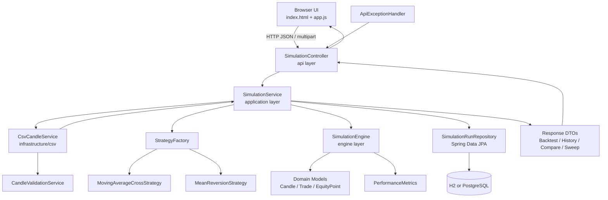

# Architecture Diagram

This diagram shows how data moves through the simulator from UI/API input to strategy execution, persistence, and response rendering.

## Layer responsibilities

- **api**: request validation, parameter mapping, response contracts
- **application**: orchestrates use-cases and persistence
- **strategy**: pure strategy signals based on candle history
- **engine**: deterministic execution loop + risk exits + metrics
- **infrastructure**: CSV parsing and database access
- **domain**: immutable records representing market and trade data
